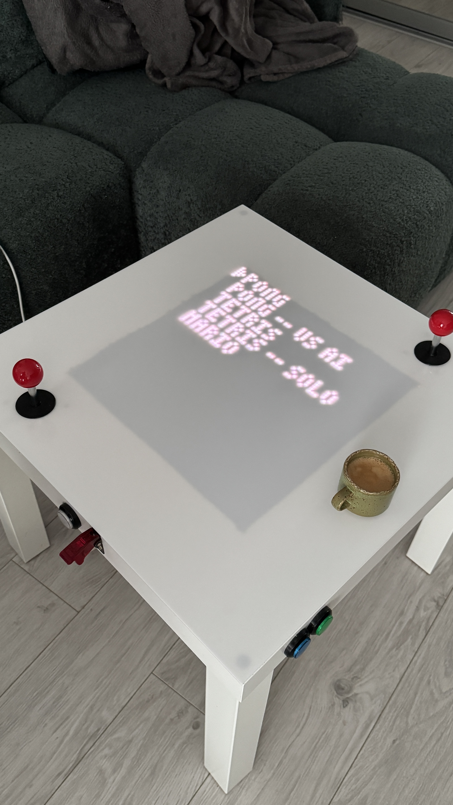

This project is by no mean finished, so it's riddled with bugs and is missing testing.

This is a small hobby project, a recreation of a couple of classic games on a 64x64 screen, so that I can run it on an microcontroller I've embedded into a coffee table. 

I have a habit of making a game engine in every language I touch and this time I wanted to make something that would run on something cheap and small (ESP32-S3). This is a third rewrite of the engine, although with each rewrite I'm adding more stuff. First the engine was made in JS, but it would be too slow, so I rewrote the thing onto C++ which I grew to hate so now it's a Rust project and I'm loving it this way. It's been a great playground for me to learn Rust, thus I mostly use AI only to have something about Rust explained or to fix bulks of warnings.

It's running at my home in my modified IKEA Lack coffee table. I mounted into it two 32x64 HUB75 screens, five arcade buttons and two arcade joysticks.



## Pong
https://youtube.com/watch?v=Q6AuwsqM4

## Mario
https://youtube.com/watch?v=a6ZRBHZmRm8

## Tetris
https://youtube.com/watch?v=nLQnlUtXMug

# How to run

It can be run either on a desktop or on an esp32, so it has two entry points.

To run on a desktop (tested only on Mac):

```
cd desktop_main
cargo run
```

Setting `STOLIK_DEBUG` env var to `1` will enable debug features (drawing colliders). Works only for desktop.

To run on esp32:

```
cd esp32_main
cargo espflash flash --release --monitor --bin esp32_main
```

```
cargo espflash flash --release
```

Or to build for esp32:
```
cargo build --release --bin esp32_main
```

```
RUSTFLAGS="-A warnings" cargo build --release --bin esp32_main
```

# Common
The `common/` directory contains logic the engine logic but also the scenes. It *should* remain platform-agnostic, so for example I created an abstraction for threading so that I can use a trait `Thread` in `Engine::run` which has a method for e.g. sleeping. At the same time I'm using conditional dependencies and a cfg attribute for displaying logs while monitoring an esp32 flash, but that's temporary and will disappear in the future.

# Desktop
That project basically runs the engine and displays a grid of 64x64 circles, which simulate LEDs. Each pixel generated by the engine is displayed on a respective circle.
Keymap (as per `desktop_main/src/desktop_input.rs`): 
| Keyboard Key | Engine Key            |
| ------------ | --------------------- |
| Space        | Start                 |
| S            | Player 1 Stick Down   |
| W            | Player 1 Stick Up     |
| A            | Player 1 Stick Left   |
| D            | Player 1 Stick Right  |
| F            | Player 1 Blue Button  |
| G            | Player 1 Green Button |
| Down         | Player 2 Stick Down   |
| Up           | Player 2 Stick Up     |
| Left         | Player 2 Stick Left   |
| Right        | Player 2 Stick Right  |
| O            | Player 2 Blue Button  |
| P            | Player 2 Green Button |
